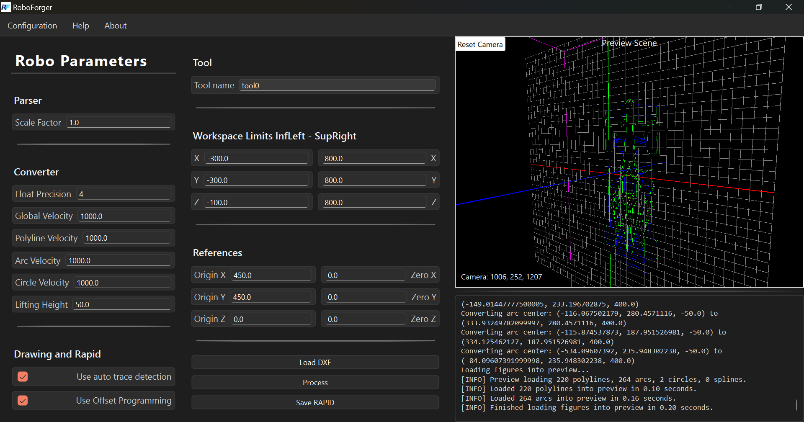

# RoboForger

RoboForger converts 2D CAD geometry (`.dxf` and `.dwg`) into ABB RAPID drawing code.

It includes:
- A desktop GUI built with **PySide6/QML**
- A Python processing pipeline for parsing, conversion, path planning, and RAPID code generation



## Features

- Import CAD files from DXF and DWG formats
- Parse lines, arcs, circles, and splines
- Convert geometry into RoboForger internal figures
- Generate RAPID code from detected drawing traces
- Export generated RAPID code to `.txt`

## Requirements

- **Python**: `>=3.13,<3.14`
- **OS**: Windows recommended (project currently bundles Windows LibreDWG binaries)

Core dependencies (from `pyproject.toml`):
- `PySide6`
- `numpy`
- `ezdxf`
- `PyOpenGL`

## Quick Start

### 1) Clone

```bash
git clone <your-repo-url>
cd RoboForger
```

### 2) Create environment and install

Using pip:

```bash
python -m venv .venv
.venv\Scripts\activate
python -m pip install --upgrade pip
pip install -e .
```

Using Poetry:

```bash
poetry install
poetry shell
```

### 3) Run the app

```bash
python -m RoboForger.main
```

If the module launch does not work in your setup, run directly:

```bash
python RoboForger/main.py
```

## How It Works (Pipeline)

RoboForger processes files in four stages:

1. **Parse CAD**: read DXF directly, or DWG via bundled `dwg2dxf.exe`
2. **Convert**: map raw entities to internal figure classes
3. **Detect drawing order**: organize traces for drawing execution
4. **Generate RAPID**: create ABB RAPID text output

Core implementation lives in `RoboForger/forger.py`.

## Programmatic Usage (Library)

```python
from RoboForger.forger import Forger, ForgerParameters

params = ForgerParameters()
forger = Forger(params)

forger.parse_figures("test_files/test.dxf")
forger.convert_figures()
forger.generate_rapid_code()

rapid = forger.get_rapid_code()
forger.export_rapid_to_txt("output.txt")
```

## Build / Distribution

### Build standalone executable (Nuitka)

```bash
python build_nuitka.py
```

Debug build:

```bash
python build_nuitka.py --debug
```

### Build installer (Inno Setup)

```bash
python build_installer.py
```

> `build_installer.py` expects `iscc` (Inno Setup Compiler) to be available in your `PATH`.

## Testing

Current repository includes exploratory tests and scripts under `tests/`.

Run with:

```bash
pytest
```

## Troubleshooting

- **Crash dialog appears on startup**: check `crash_log.txt` in the project root.
- **DWG import fails**: verify `RoboForger/resources/bin/libredwg/` contains `dwg2dxf.exe` and `libredwg-0.dll`.
- **Qt/QML runtime issues**: ensure dependencies installed in the active environment and use Python 3.13.

## Project Structure

- `RoboForger/`: main application and processing code
- `RoboForger/resources/`: icons, QML, styles, config, LibreDWG binaries
- `docs/`: screenshots and technical notes
- `tests/`: test and plotting scripts
- `test_files/`: sample CAD and exported output files

## License

MIT — see [LICENSE](./LICENSE).

## Acknowledgements

- [LibreDWG](https://www.gnu.org/software/libredwg/) for DWG conversion tooling